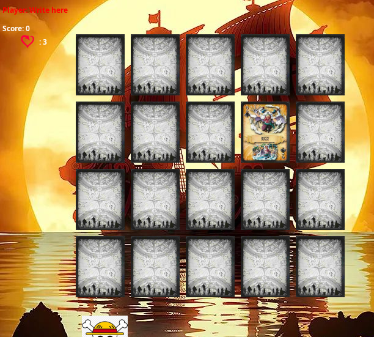
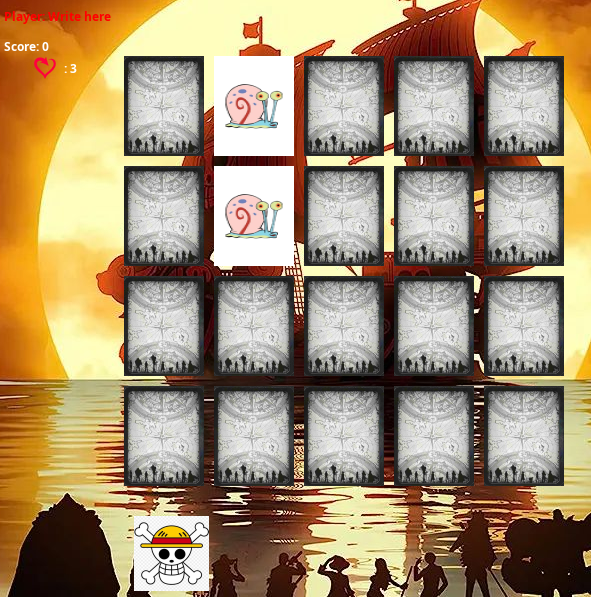

# Memory Game
## description
It is a simple memory game developed in Java using data structure to implement points, lives and manage cards and the Swing library for the graphical interface. The game consists of finding pairs of identical cards within a grid of face down cards.
## caracteristics
- interface graphique of user friendly 
- Three levels with different sets of cards.
- Score that increases by finding pairs of identical cards.
- Life system that penalizes the player for choosing incorrect cards.
- Stopwatch to track playing time.
## instructions for use
1. clone or download the repository
2. make sure you have java installed

  

## Data Structures Used
- LinkedList for Handling Card Numbers (Carts Class):

    A LinkedList is used to generate and shuffle the numbers that represent the cards in the game

- linkedList for the management of the cards (Carts Class):

    A LinkedList is used to manage the cards in the game. The list allows for efficient management of the cards, as the cards are removed from the list when they are matched.

- Queue for Player Lives Management (Lives Class):

  A Queue is used to manage the player's lives. The queue allows for efficient management of remaining lives, as the player loses a life with every incorrect move in the game

## credites
this game was created by:
Armando Nuñez Condori 
Charly Alezander Terrazas
as part of the data structure course

## references
https://youtube.com/playlist?list=PLc_8_1G9IIB6WCH4jWegHO5UKnpzCitgY&si=31Sa8lZDB95-7T5O
videos from which ideas about the logic of the game were chosen